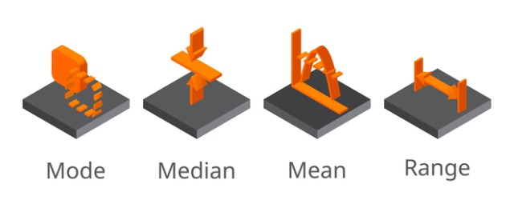
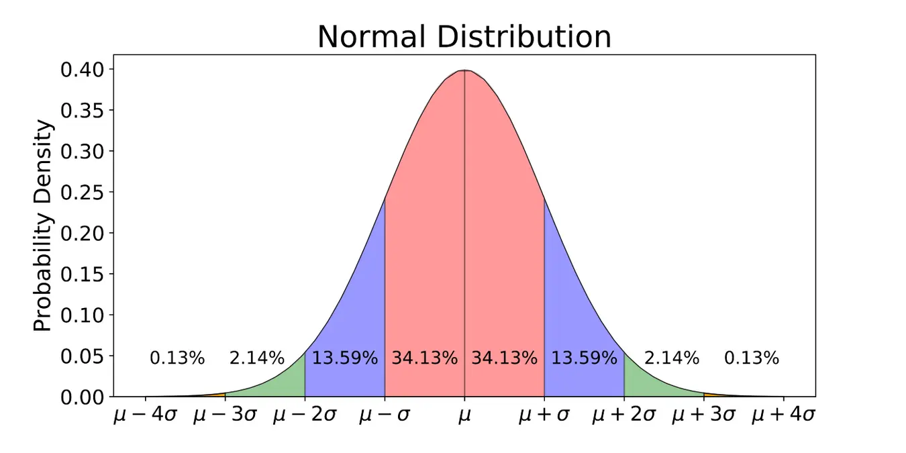
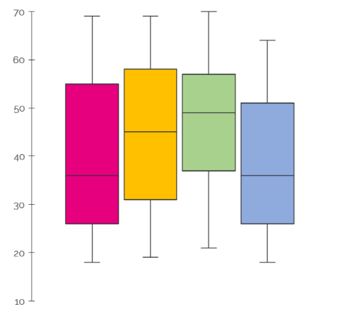

## Statistical analysis
### Descriptive statistics 
Descriptive statistics explore your data characteristics either quantitatively (mean, median, mode, standard deviatoin, variation etc.) or visually (distribution, skewness, kurtosis etc.). 
#### [Summary statistics](Summary_statistics.md)

#### [Normality](Normality.md)

#### [Box-plot](Boxplot.md)

### Inferential statistics
Inferential statistics enables you to draw inferences and conclusions from your data based on probabilty measure. In other words, it helps in drawing conclusions about a population by examining random samples.

#### Parameteric tests
If your data have normal distribution and equal variance accross groups then you can execute following parametric test depending upon your data types.

A. <ins>Test for frequency data</ins>
#### [Chi-square test](Chi-Square_Test.md)

B. <ins>Test for continous data</ins>
1. Test of single group
#### T-test
#### Z-test
3. Test of more than one group
#### [One-way ANOVA](One-way_ANOVA.md)
3. Test of two categories of groups
#### [Two-way ANOVA](Two-way_ANOVA.md)

#### Non-parameteric test

## Phylogenetic analysis
#### [NCBI tutorial](https://www.ncbi.nlm.nih.gov/)
#### [Sequence alignment: MEGA](https://www.megasoftware.net/))
#### [Phylogenetic tree: RaxML and MrBayes](https://www.ncbi.nlm.nih.gov/)

## Downstream processing of NGS data
#### SEED_pipeline
#### SSU_pipeline

## Functional guild analysis of fungal metagenomic data
#### FunGuild

